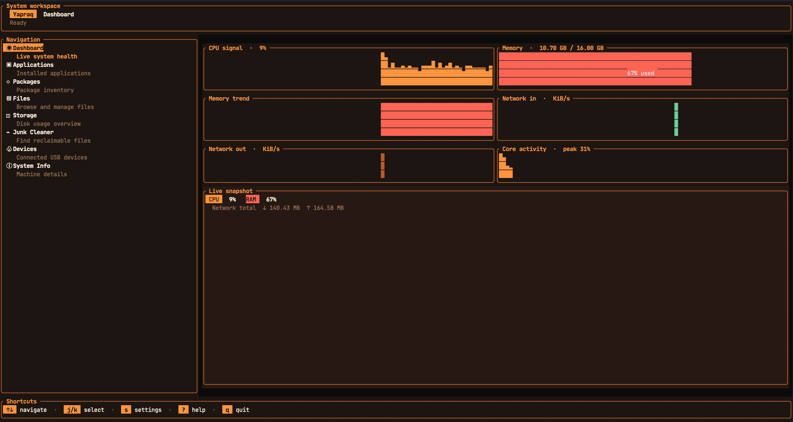

<h1 style="text-align: center">
🍃 Yapraq 🍃
</h1>

**<p style="text-align: center">A beautiful terminal-based system monitor and workspace manager</p>**

<p style="text-align: center">Yapraq is a feature-rich TUI application built with Rust that provides real-time system monitoring, file management, junk cleanup, and more — all from your terminal.</p>



<br/>


## ✨ Features

- **📊 Dashboard** — Live system health monitoring (CPU, memory, disk usage)
- **📱 Applications** — Browse and manage installed applications
- **📦 Packages** — View installed packages with uninstall commands
- **📁 File Manager** — Navigate, create, rename, and delete files/folders
- **💾 Storage** — Disk usage overview with visual bars
- **🧹 Junk Cleaner** — Find and remove reclaimable files
- **🔌 Devices** — Monitor connected USB devices
- **ℹ️ System Info** — View detailed machine information
- **🎨 Multiple Themes** — Choose from 5 beautiful themes (Smoked Amber, Bluish, Greenish, Metallic, Dracula)
- **⚡ Fast & Lightweight** — Built with Rust for performance
- **🔒 Secure** — Built with security best practices and input validation

## 📦 Installation

### From Source

```bash
# Clone the repository
git clone https://github.com/Milad-HajiShafiei/yapraq.git
cd yapraq

# Build the project
cargo build --release

# Run Yapraq
./target/release/yapraq
```

### Using Cargo

```bash
cargo install --path .
```

## 🎯 Usage

Simply run the application:

```bash
yapraq
```

### Keyboard Shortcuts

| Key | Action |
|-----|--------|
| `↑` / `↓` | Navigate between sidebar sections |
| `1` - `8` | Jump directly to a section |
| `F1` - `F8` | Jump directly to a section |
| `j` / `k` | Move through the current list |
| `Enter` | Open selected file/folder |
| `Backspace` | Go to parent folder (in Files) |
| `s` | Open settings |
| `?` | Show help |
| `q` / `Ctrl+C` | Quit |

### Files Tab

| Key | Action |
|-----|--------|
| `n` | Create new folder |
| `f` | Create new file |
| `e` | Rename selected item |
| `x` | Delete selected item |
| `r` | Refresh current folder |

### Junk Cleaner Tab

| Key | Action |
|-----|--------|
| `S` | Scan for junk files |
| `d` | Delete selected junk |
| `D` | Delete all junk |

### Apps Tab

| Key | Action |
|-----|--------|
| `a` | Scan installed applications |

### Packages Tab

| Key | Action |
|-----|--------|
| `p` | Scan installed packages |
| `i` | Show uninstall command |

### Devices Tab

| Key | Action |
|-----|--------|
| `r` | Refresh USB device list |

## ⚙️ Settings

Press `s` to open the settings modal where you can:

- **Change Theme** — Select from 5 available themes:
  - 🟠 Smoked Amber (default)
  - 🔵 Bluish
  - 🟢 Greenish
  - ⚪ Metallic
  - 🟣 Dracula
- **About** — View application information

### Settings Navigation

| Key | Action |
|-----|--------|
| `↑` / `↓` or `h` / `l` | Switch between sections |
| `j` / `k` | Navigate items within section |
| `Enter` / `Space` | Select item |
| `Esc` / `s` | Close settings |

## 🎨 Themes

Yapraq comes with 5 carefully designed themes:

### Smoked Amber
A warm, amber-toned theme with dark backgrounds and orange accents. Perfect for late-night coding sessions.

### Bluish
A cool blue theme with deep navy backgrounds and bright cyan accents. Easy on the eyes.

### Greenish
A nature-inspired theme with dark green backgrounds and vibrant green accents. Refreshing and calming.

### Metallic
A sleek, professional theme with neutral gray tones. Clean and modern.

### Dracula
A popular theme with purple and pink accents on dark backgrounds. Vibrant and stylish.

## 🔒 Security

Yapraq is built with security best practices to protect your system:

### Security Features

| Feature | Description |
|---------|-------------|
| **Path Traversal Protection** | Blocks directory traversal attacks (e.g., `../`) |
| **Input Sanitization** | Removes control characters from filenames |
| **Error Message Sanitization** | Hides sensitive system paths from error messages |
| **Safe Delete Operations** | Validates paths before deletion |
| **Mutex Poisoning Recovery** | Graceful handling of lock failures |
| **Path Safety Validation** | Blocks access to sensitive system paths |

### Security Best Practices

```rust
// Example: Sanitized error messages
let error = "Permission denied /home/user/file.txt";
let safe = sanitize_error_message(error);
// Result: "Access denied ~/file.txt"

// Example: Safe filename validation
let name = "file\x00name.txt";
let safe = sanitize_filename(name);
// Result: "filename.txt"
```

### Protected Paths

The application automatically blocks operations on:
- `/proc/*` — Linux process filesystem
- `/sys/*` — Linux sys filesystem
- `~/.ssh/*` — SSH keys
- `~/.gnupg/*` — GPG keys

### Security Testing

Yapraq includes comprehensive security tests:

```bash
# Run security tests
cargo test

# Run specific security tests
cargo test sanitize
cargo test is_path_safe
```

For advanced security testing with Strix AI:

```bash
# Install Strix (requires Docker)
curl -sSL https://strix.ai/install | bash

# Run security scan
strix --target ./yapraq
```

## 🏗️ Architecture

```
yapraq/
├── src/
│   ├── main.rs           # Application entry point
│   ├── app.rs            # Core application state and logic
│   ├── utils.rs          # Utility functions (including security)
│   ├── events/           # Event handling system
│   ├── features/         # Feature modules
│   │   ├── monitor/      # System monitoring
│   │   ├── apps/         # Application management
│   │   ├── packages/     # Package management
│   │   ├── files/        # File management
│   │   ├── storage/      # Storage information
│   │   ├── junk/         # Junk file detection
│   │   ├── devices/      # USB device detection
│   │   └── info/         # System information
│   └── tui/              # Terminal UI components
│       ├── theme.rs      # Theme system (with mutex safety)
│       ├── mod.rs        # UI rendering
│       └── components/   # UI components
│           ├── header.rs
│           ├── sidebar.rs
│           ├── footer.rs
│           ├── help.rs
│           └── settings.rs
├── SECURITY_REVIEW.md    # Security audit report
└── README.md
```

### Security Modules

| Module | Purpose |
|--------|---------|
| `utils::sanitize_error_message()` | Clean error messages for display |
| `utils::sanitize_filename()` | Remove dangerous characters from filenames |
| `utils::is_path_safe()` | Validate paths against dangerous patterns |
| `app::is_valid_entry_name()` | Validate file/folder names |
| `app::is_safe_child()` | Validate parent-child path relationships |

## 🔧 Dependencies

- **ratatui** — Terminal UI framework
- **crossterm** — Terminal manipulation
- **tokio** — Async runtime
- **sysinfo** — System information
- **rusb** — USB device detection
- **walkdir** — Directory traversal
- **anyhow** — Error handling

## 🧪 Testing

Run all tests including security tests:

```bash
# Run all tests
cargo test

# Run tests with output
cargo test -- --nocapture

# Run specific test module
cargo test utils::tests
cargo test app::tests
```

### Test Coverage

- **17 tests** covering core functionality
- **10 security tests** for input validation and path safety
- **7 unit tests** for utility functions

## 📄 License

MIT License

**Made with ❤️ and Rust** 🦀
